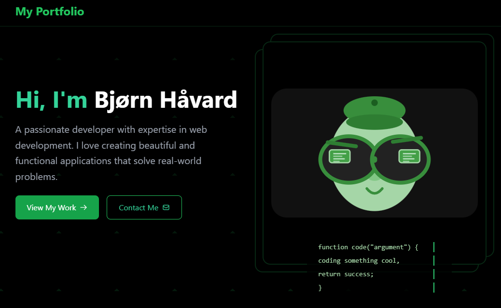
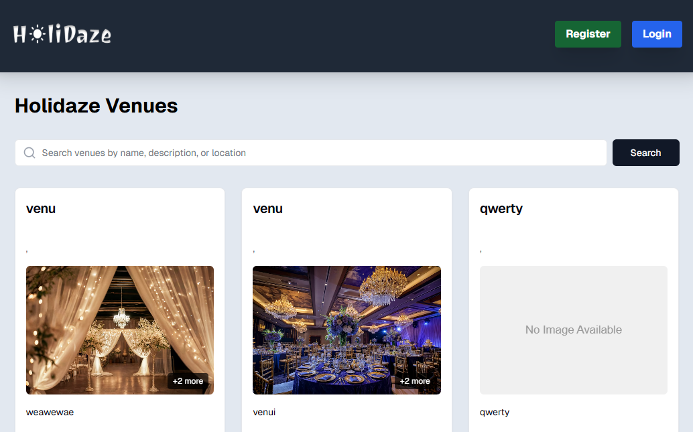
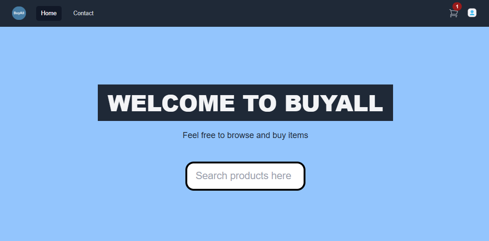
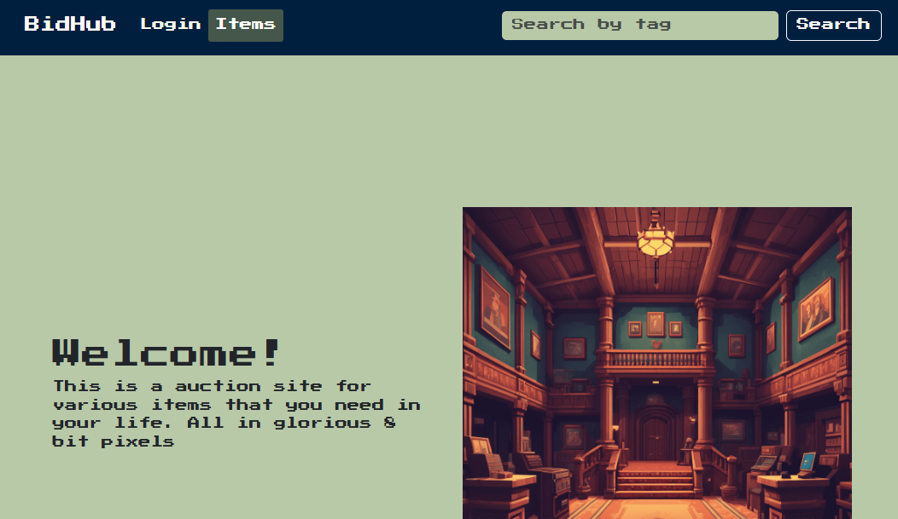
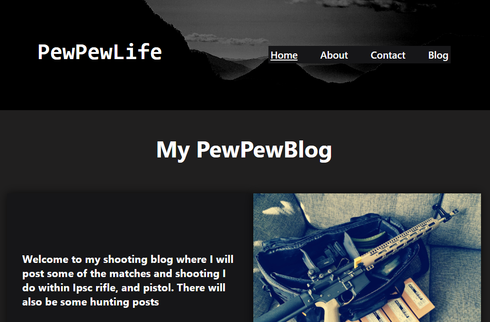
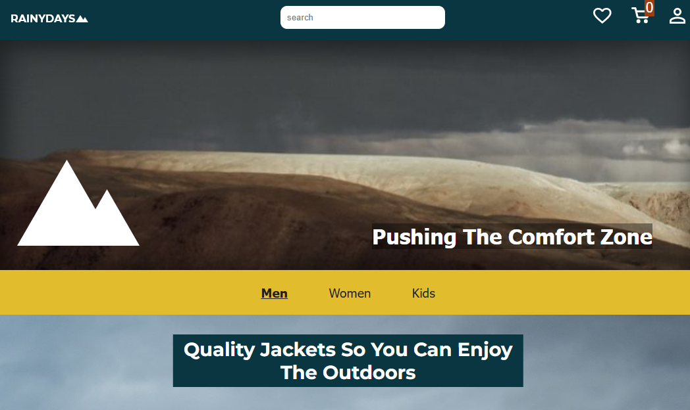
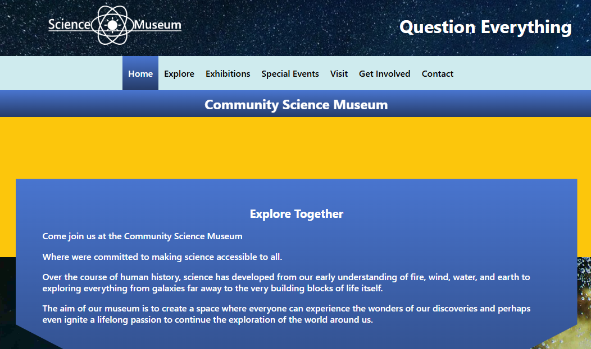

# 👋 Hello, I'm Bjørn Håvard Steinnes

🎓 Front-End Development Student at [Noroff School of Technology and Digital Media](https://www.noroff.no/)  
🚜 Former logistics worker & forklift operator turned aspiring developer  
🎮 Lifelong gamer now channeling curiosity into code  
📍 Based in Norway

I'm currently pursuing a career shift into tech, diving deep into frontend development. With a passion for understanding how things work and a growing love for web technologies, I'm building projects that blend design, function, and accessibility. Through this journey, I'm aiming to turn a long-standing curiosity into a rewarding career.

---

## 🛠️ Skills

---

## 🚀 Projects

| Project                      | Description                                                     | Live                                                                 | GitHub                                                                                 |
| ---------------------------- | --------------------------------------------------------------- | -------------------------------------------------------------------- | -------------------------------------------------------------------------------------- |
| **Portfolio Page**           | My personal developer portfolio showcasing projects and skills  | [🔗 View](https://bjornhaavard.github.io/Portfolio-2/)               | [📂 Repo](https://github.com/bjornhaavard/Portfolio-2)                                 |
| **HoliDaze**                 | Holidaze Venue app for booking and creating venues to visit     | [🔗 View](https://holidais.netlify.app/)                             | [📂 Repo](https://github.com/bjornhaavard/project-exam-2)                              |
| **BuyAll**                   | E-commerce site built with Next.js and Noroff's online shop API | [🔗 View](https://buyall.netlify.app/)                               | [📂 Repo](https://github.com/bjornhaavard/JS-framework-CA)                             |
| **BidHub**                   | Auction platform with product bidding and timer logic           | [🔗 View](https://magnificent-axolotl-a473b6.netlify.app/index.html) | [📂 Repo](https://github.com/bjornhaavard/BidHub)                                      |
| **My Blog**                  | A blogging platform built as part of a semester project         | [🔗 View](https://magnificent-axolotl-a473b6.netlify.app/index.html) | [📂 Repo](https://github.com/Noroff-FEU-Assignments/project-exam-1-bjornhaavard)       |
| **RainyDays**                | Webshop for rain jackets, built with HTML/CSS/JS                | [🔗 View](https://kind-wilson-46a5f7.netlify.app/)                   | [📂 Repo](https://github.com/Noroff-FEU-Assignments/cross-course-project-bjornhaavard) |
| **Community Science Museum** | Informational website for a fictional museum                    | [🔗 View](https://snazzy-conkies-f91116.netlify.app/)                | [📂 Repo](https://github.com/bjornhaavard/Community_science-museum)                    |

---

## 🖼️ Screenshots

  
📸 Portfolio Page

  

  
📸 Holidaze Venue page

  

  
🛍️ BuyAll E-commerce

  

  
📦 BidHub Auction

  

  
📝 Blog Platform

  

  
🌧️ RainyDays Shop

  

  
🏛️ Community Science Museum

  

---

## 📫 Contact

- 📧 [bjornhaavard@hotmail.com](mailto:bjornhaavard@hotmail.com)
- 📸 [Instagram](https://www.instagram.com/bjornhaavardsteinnes/)
- 💼 [LinkedIn](https://www.linkedin.com/in/bj%C3%B8rn-h%C3%A5vard-steinnes-87333b21a/)

---

_Thanks for checking out my work! I’m always open to collaboration, feedback, or just connecting with others in the tech space._
