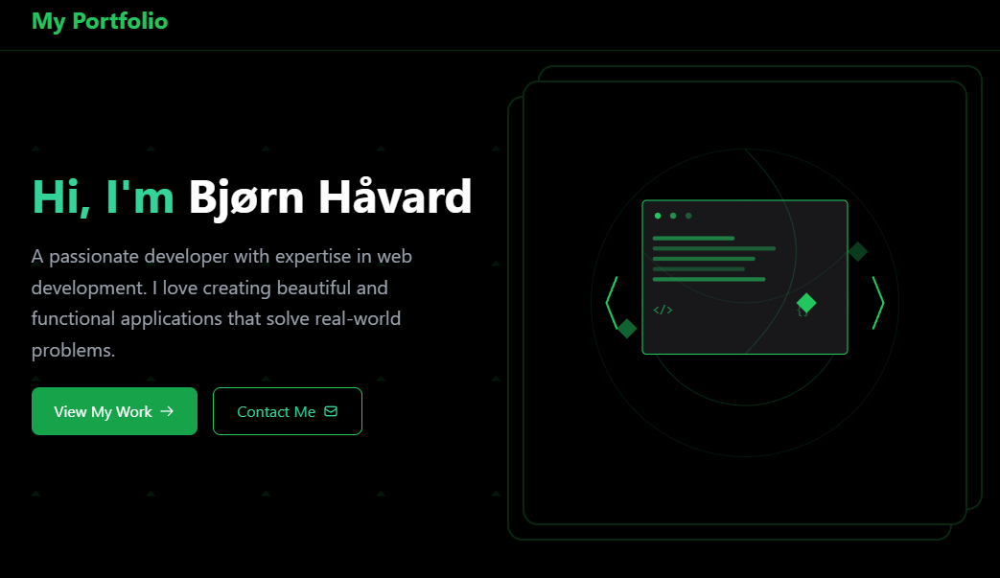

## Hello, my name is Bjørn Håvard Steinnes and I am a student in front end development at NOROFF👋

### I am a 42 year old who has worked my whole life in the logistics area, specifically warehouses and forklift driving. I want to expand my knowledge and change my course of work to computers. I have always been a computer guy, mostly used for gaming, but I also have a curiosity for how things work, and coding and programming has always been something I have been interested in, but never actually done. With this education under Noroff I hope to be able to change my path and find a different line og carrier and passion.

### I'm currently working on my Portfolio Page. 

### I am learning: 

- HTML 
- CSS 
- JavaScript 
- Wordpress
- CSS frameworks
- JS frameworks
- React
- Next

### Projects.

:nerd_face: [Portfolio page](https://bjornhaavard.github.io/Portfolio-2/)

:octocat: [Github](https://github.com/bjornhaavard/Portfolio-2)

--------------------------------------------------------

:heavy_dollar_sign: [BuyAll site](https://buyall.netlify.app/)

:octocat: [Github](https://github.com/bjornhaavard/JS-framework-CA)

--------------------------------------------------------

:slightly_smiling_face: [BidHub](https://magnificent-axolotl-a473b6.netlify.app/index.html)

:octocat: [Github](https://github.com/bjornhaavard/BidHub)

--------------------------------------------------------

:slightly_smiling_face: [My blog](https://magnificent-axolotl-a473b6.netlify.app/index.html)

:octocat: [Github](https://github.com/Noroff-FEU-Assignments/project-exam-1-bjornhaavard/tree/main)

--------------------------------------------------------

:national_park: [RainyDays](https://kind-wilson-46a5f7.netlify.app/)

:octocat: [Github](https://github.com/Noroff-FEU-Assignments/cross-course-project-bjornhaavard)

--------------------------------------------------------

:robot: [Community science musesum](https://snazzy-conkies-f91116.netlify.app/)

:octocat: [Github](https://github.com/bjornhaavard/Community_science-museum)

--------------------------------------------------------

###  📫 How to reach me:

[Email](bjornhaavard@hotmail.com)

[My Instagram page](https://www.instagram.com/bjornhaavardsteinnes/)

[My LinkedIn page](https://www.linkedin.com/in/bj%C3%B8rn-h%C3%A5vard-steinnes-87333b21a/)
